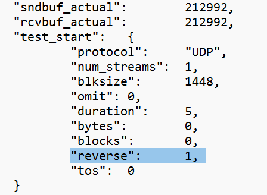
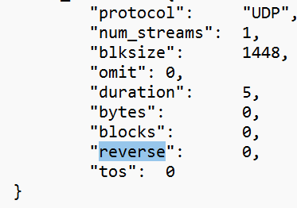
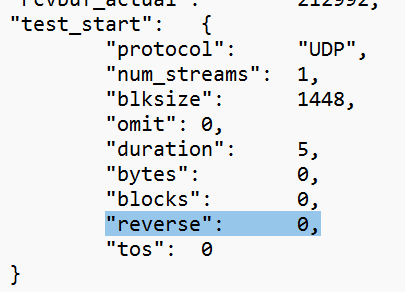
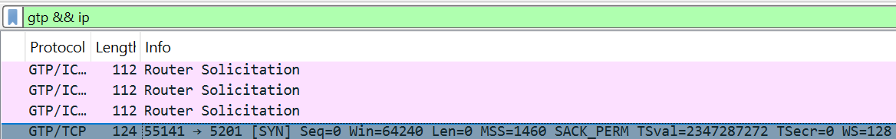
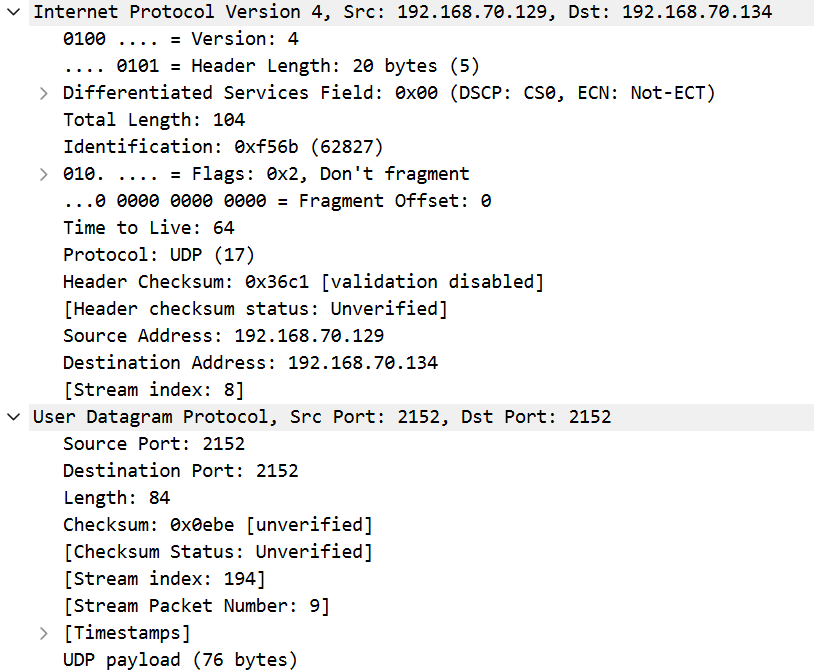
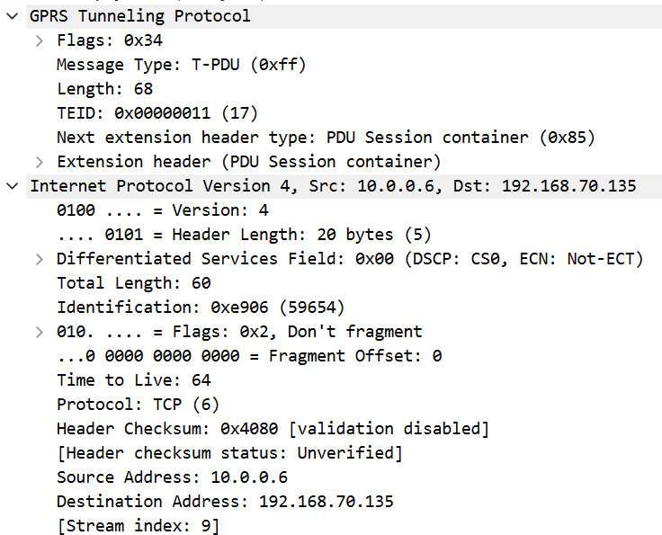

# Lab 2: gNB TDD Traffic Analysis

## 1. Goal

In this lab, you will compare three 5-second UDP iperf3 tests. You will learn how TDD slot allocation can affect downlink and uplink performance.

You do not need to understand every packet. Follow the steps, complete the tables, and answer the short questions.

## 2. Test Scenarios

| Scenario | TDD setting | Traffic direction | Main idea |
| --- | --- | --- | --- |
| A | DL-heavy | Downlink | The TDD setting favors the traffic direction |
| B | DL-heavy | Uplink | There are fewer opportunities for uplink traffic |
| C | Balanced | Uplink | More uplink opportunities are available than in B |

[Files](https://drive.google.com/drive/u/0/folders/1gTgosNkWFuak_sXbHFTxqaRqXb15Wz9T)(download in google drive )

| Scenario | iperf3 JSON | Wireshark capture |
| --- | --- | --- |
| A | `scenario-a-downlink.json` | `scenario-a-dl-heavy-downlink.pcapng` |
| B | `scenario-b-uplink.json` | `scenario-b-dl-heavy-uplink.pcapng` |
| C | `scenario-c-uplink.json` | `scenario-c-balanced-uplink.pcapng` |

## 3. Task 1 — Confirm the Traffic Direction

Open each JSON file and find:

```text
start → test_start → reverse
```

- `reverse: 1` means downlink in this lab.
- `reverse: 0` means uplink in this lab.

Complete the table:

| Scenario | Reverse value | Direction |
| --- | ---: | --- |
| A | 1 | Downlink |
| B | 0 | Uplink |
| C | 0 | Uplink |

**Question:** Does the traffic direction shown in the JSON match the scenario description? Show the proof.

Yes, all traffic directions match the scenario descriptions. In start -> test_start -> reverse, Scen A has the Value 1 (downlink), Scenarios B and C have the value 0 (uplink).

Scenario A:



Scenario B:



Scenario C:



## 4. Task 2 — Compare Throughput

In each JSON file, find:

```text
end → sum → bits_per_second
```

Convert the value to Mbps:


```text
Throughput (Mbps) = bits_per_second ÷ 1,000,000
```


Complete the table:

| Scenario | Direction | Throughput (Mbps) |
| --- | --- | ---: |
| A | Downlink | 90.654 |
| B | Uplink | 109.117 |
| C | Uplink | 124.417 |

Calculate how much C improves over B:

```text
Improvement (%) = (C - B) ÷ B × 100
```

Answer:

Improvement = (124.416749 − 109.117250) / 109.117250 × 100 = 14.02%


1. What is the downlink throughput in Scenario A?

Scenario A has a downlink throughput of 90.65 Mbps

2. What is the uplink throughput in Scenario B?

Scenario B has an uplink throughput of 109.12 Mbps

3. Is the uplink throughput higher in B or C?

Uplink throughput is higher in Scenario C, at 124.42 Mbps

4. By approximately what percentage does C improve over B?

Scenario C improves uplink throughput by approximately 14.02% compared with B

> Use the JSON `bits_per_second` value. Do not recalculate throughput using the other time fields.

## 5. Task 3 — Check the Trade-off

In each JSON file, find:

```text
end → sum → lost_percent
end → sum → jitter_ms
```

Complete the table:

| Scenario | Throughput (Mbps) | Packet loss (%) | Jitter (ms) |
| --- | ---: | ---: | ---: |
| B | 109.117 | 0,236 | 0,116 |
| C | 124.417 | 2.134 | 0.162 |


Answer:

1. Does C have higher uplink throughput than B?

Yes, Scenario C has higher uplink throughput than B: 124.42 Mbps compared with 109.12 Mbps

2. Does C have lower packet loss than B?

No, C has higher packet loss: 2.134% compared with 0.236%

3. What is the trade-off when changing from B to C?

Scenario C has higher throughput, but higher packet loss than Scenario B. Therefore, the balanced TDD setting improves uplink throughput, but it may reduce delivery reliability

A simple answer format is:

> Scenario C has ______ throughput, but ______ packet loss than Scenario B. Therefore, the balanced TDD setting improves ______, but it may reduce ______.

## 6. Task 4 — Is the TDD Setting Suitable?

Complete the table using the scenario description and your throughput results:

| Scenario | TDD setting | Traffic direction | Do they match? |
| --- | --- | --- | --- |
| A | DL-heavy | Downlink | Yes |
| B | DL-heavy | Uplink | Poor match: limited UL opportunities |
| C | Balanced | Uplink | More suitable than B: more UL opportunities |

Use these ideas:

- More DL slots provide more downlink transmission opportunities.
- More UL slots provide more uplink transmission opportunities.
- A DL-heavy setting is suitable for downlink traffic.
- A DL-heavy setting may limit heavy uplink traffic.
- A balanced setting gives uplink traffic more opportunities than a DL-heavy setting.

**Question:** Why might Scenario C achieve better uplink throughput than Scenario B?

Scenario C may achieve higher uplink throughput because the balanced TDD setting provides more uplink slots than the DL-heavy setting in Scenario B. This gives the UE more opportunities to transmit uplink data.

## 7. Task 5 — Find GTP-U Information

Open a `.pcapng` file in Wireshark and enter this display filter:

```text
gtp && ip
```

Choose a packet that contains two IPv4 headers. In the packet details, expand:

1. the first `Internet Protocol Version 4` header;
2. `User Datagram Protocol`;
3. `GPRS Tunneling Protocol`; and
4. the second `Internet Protocol Version 4` header.

Record the following information from one packet:

| Item | Value |
| --- | --- |
| Packet number | 1831 |
| Outer source IP | 192.168.70.129 |
| Outer destination IP | 192.168.70.134 |
| Inner source IP | 10.0.0.6 |
| Inner destination IP | 192.168.70.135 |
| TEID | 0x00000011 (17) |

Meaning:

- **Outer IP addresses:** the GTP-U tunnel endpoints.
- **Inner IP addresses:** the original UE/application packet.
- **TEID:** identifies the GTP-U tunnel.

Take one screenshot showing the selected packet and these fields.





> Some GTP packets are echo or control-related packets. Select one that contains an inner IPv4 packet.

## 8. Task 6 — TCP Retransmissions

The performance traffic is UDP, but iperf3 also uses a small TCP control connection.

Apply this Wireshark filter:

```text
tcp.analysis.retransmission
```

Record the number of displayed packets:

| Scenario | Displayed TCP retransmissions |
| --- | ---: |
| A | 14 |
| B | 12 |
| C | 12 |

**Question:** Do these TCP retransmissions directly represent lost UDP performance packets?

No, these TCP retransmissions do not directly represent lost UDP performance packets. They belong to the TCP control connection, while the throughput test uses UDP. Since the captures may contain duplicate packets from merged capture sources, the counts should be treated only as Wireshark observations.

The answer should be **no**. They belong to the TCP control connection, while the throughput test uses UDP. The captures may also contain duplicate copies because multiple capture sources were merged, so treat the number only as a Wireshark observation.

## 9. Task 7 — RTT and Packet Interval

### TCP RTT

Apply:

```text
tcp.analysis.ack_rtt
```

Select one packet and record its ACK RTT:

| Scenario | Example TCP ACK RTT |
| --- | --- |
| C | 315us |

This value is the RTT of the TCP control connection. It is not the RTT of the UDP data packets.

### Packet interval

Select two nearby packets from the same flow. In the packet details, find:

```text
Time delta from previous displayed frame
```

Record one example:

| Flow | Packet numbers | Time interval |
| --- | --- | --- |
| Scenario C, TCP stream 0 | 1430-1431 | 16us |

Packet interval means the time between two packets seen at the capture point. It is not the same as RTT.

## 10. Final Questions

Answer each question in two or three sentences:

1. Does Scenario A use a TDD setting that matches its traffic direction?

Yes, Scenario A uses a DL-heavy TDD setting for downlink traffic. More downlink slots provide more opportunities for downlink transmission.

2. Why is Scenario B expected to have limited uplink resources?

Scenario B uses a DL-heavy setting, which allocates more slots to downlink and fewer to uplink. Therefore, the UE has fewer opportunities to transmit uplink data.

3. How much does uplink throughput change from B to C?

Uplink throughput increases from 109.12 Mbps in B to 124.42 Mbps in C. This is an increase of approximately 15.30 Mbps, or 14.02%.

4. What negative result is visible in C?

Packet loss increases from approximately 0.236% in B to 2.134% in C. Jitter also increases from 0.116 ms to 0.162 ms.

5. Why can increasing UL slots improve uplink throughput?

More uplink slots give the UE more transmission opportunities. This can allow more uplink data to be transferred per second.

6. Is adding more UL slots always the best solution? Explain using throughput and packet loss.

No, throughput and packet loss must both be considered when evaluating a TDD setting. In these tests, C achieves higher throughput but also higher packet loss, so it does not improve every performance metric.

7. Suggest one simple follow-up test that could improve throughput without producing too much packet loss.

Repeat Scenario C with a slightly lower offered UDP sending rate while keeping the balanced TDD setting unchanged. Compare the measured throughput and packet loss to find a rate that maintains a throughput advantage over B with less loss.

## 11. Submission Checklist

Submit one Markdown file containing:

- the completed direction table;
- the throughput table and B-to-C calculation;
- the B/C packet-loss and jitter table;
- one GTP-U screenshot;
- the TCP retransmission count;
- one TCP ACK RTT example;
- one packet-interval example; and
- answers to the final questions.

## 12. Grading Rubric

| Item | Points |
| --- | ---: |
| Traffic direction | 10 |
| Throughput values and calculation | 25 |
| B/C trade-off | 20 |
| TDD explanation | 15 |
| GTP-U fields and screenshot | 15 |
| TCP retransmission, RTT, and packet interval | 10 |
| Clear final answers | 5 |
| **Total** | **100** |

